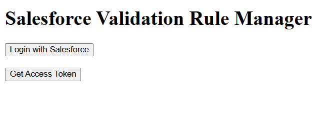
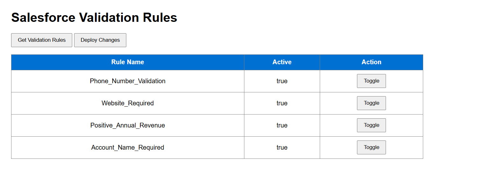

# Salesforce Validation Rule Manager

A Spring Boot based web application that integrates with Salesforce using OAuth 2.0 and Salesforce Tooling API to fetch and manage Validation Rules.

## Features

- Salesforce OAuth Login
- Fetch Validation Rules from Salesforce
- Display Validation Rules in table format
- Toggle Validation Rule status (UI simulation)
- Deploy Changes button
- Cloud deployment using Render
- GitHub integrated project

## Technologies Used

- Java
- Spring Boot
- HTML
- CSS
- JavaScript
- Salesforce OAuth 2.0
- Salesforce Tooling API
- Render
- GitHub

## Live Project

https://salesforce-validation-rule-manager-3vyu.onrender.com

## GitHub Repository

https://github.com/sujalrathore1/salesforce-validation-rule-manager

## Project Workflow

1. User logs into Salesforce
2. OAuth token is generated
3. Spring Boot backend connects to Salesforce
4. Validation Rules are fetched using Tooling API
5. Rules are displayed in UI
6. Toggle actions are handled dynamically

## Screenshots

### Login Page

### Validation Rules Dashboard

### Live Deployed Application

## Author

Sujal Rathore
